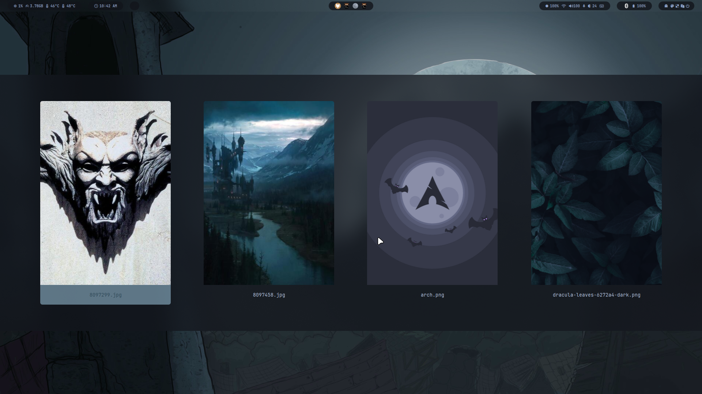

<div align = center>
    <a href="https://discord.gg/AYbJ9MJez7">
        
    </a>
</div>
<div align = center><br><br></div>

> [!IMPORTANT]
> This is not a standalone theme, needs [HyDe](https://github.com/prasanthrangan/hyprdots) installed...





## Installation

```sh
Hyde theme patch
```
and choose Dracula

---

or install another theme from [HyDe Gallery](https://github.com/kRHYME7/hyde-gallery)
