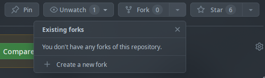
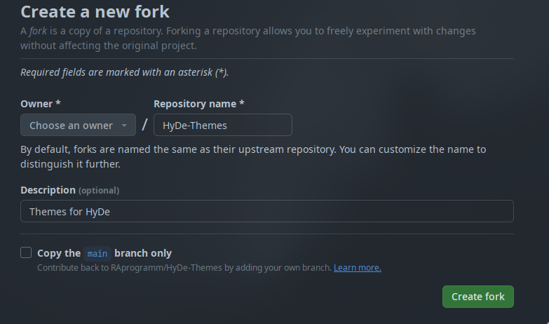

<div align = center><br><br></div>

> [!IMPORTANT]
> [HyDe](https://github.com/prasanthrangan/hyprdots) is required!

## Themes by RAprogramm
1. [Dracula](https://github.com/RAprogramm/HyDe-Themes/tree/Dracula)
2. [One-Dark](https://github.com/RAprogramm/HyDe-Themes/tree/One-Dark)

> [!TIP]
> Full list of themes you can find in [HyDe Gallery](https://github.com/kRHYME7/hyde-gallery)

## Installation

```sh
Hyde theme patch
```
and choose prefered theme from [HyDe Gallery](https://github.com/kRHYME7/hyde-gallery)

## Contributing steps:

1. Create a new fork.



2. Remove mark from this checkbox.


3. Create fork.


4. Go to theme (themes are located on the different branches).
```sh
git checkout Dracula # for example, you want to make something in Dracula theme
```

5. Create a new branch for your changes.
```sh
git checkout -b "dracula_icons" # for example, you want to change dracula theme icons
```

4. Make changes.
5. Make sure that all works in your local machine.
6. Take a screenshots.
5. Make `git push`.
6. Open PR.
