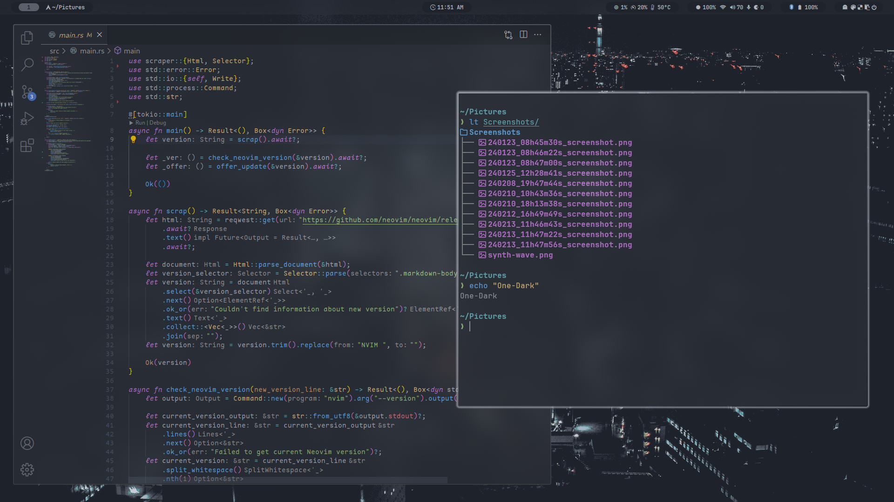
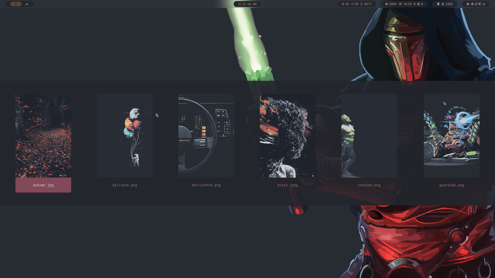
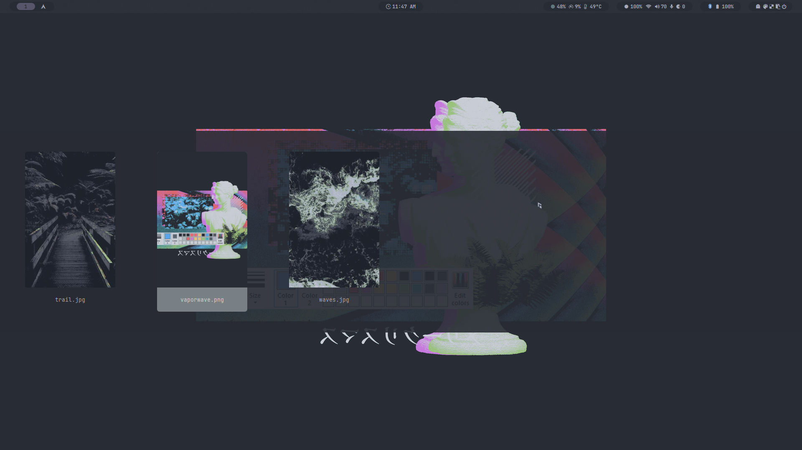

<div align = center><br><br></div>

> [!IMPORTANT]
> This is not a standalone theme, needs Hyprdots installed...







> [!NOTE]
> install this theme using themepatcher

```sh
./themepatcher.sh "One-Dark" "https://github.com/RAprogramm/hyprdots-onedark" "mskelton.one-dark-theme~One Dark Theme"
```

#### Color pallete


#### Grey reference


> [!NOTE]
> Need to check colors in all settings. And solve some issue with dolphin and kvantum.
> If someone want to help me finish this theme - welcome...
